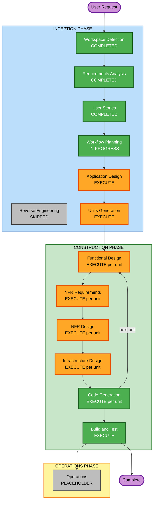

# Execution Plan — 가이아 프로젝트 온라인

## Detailed Analysis Summary

### Change Impact Assessment

| 영역 | 해당 여부 | 설명 |
|---|---|---|
| **User-facing changes** | Yes | 전체 신규 게임 플랫폼, 모든 UI/UX |
| **Structural changes** | Yes | 4-레이어 시스템 아키텍처 (엔진/서버/프론트/AI) |
| **Data model changes** | Yes | 게임 상태, 룸, 플레이어, 이벤트 로그 DB 스키마 |
| **API changes** | Yes | WebSocket 프로토콜, REST API, LLM API |
| **NFR impact** | Yes | 실시간 레이턴시, AI 응답 시간, DB 영속성 |

### Risk Assessment

| 항목 | 수준 |
|---|---|
| **Risk Level** | High |
| **Rollback Complexity** | Moderate (Docker Compose 기반 배포) |
| **Testing Complexity** | Complex (게임 규칙 검증, WebSocket 통합, AI 통합) |

**위험 요소:**
- 18개 팩션의 복잡한 게임 규칙 구현 (오류 가능성 높음)
- Rust + React + WebSocket 스택의 복잡한 통합
- LLM 코칭 AI의 응답 품질 및 레이턴시 불확실성
- MCTS AI Phase 2 구현 복잡도 (이번 범위 제외)

---

## Workflow Visualization



### Text Alternative

```
INCEPTION PHASE
  [x] Workspace Detection     — COMPLETED
  [-] Reverse Engineering     — SKIPPED (Greenfield)
  [x] Requirements Analysis   — COMPLETED
  [x] User Stories            — COMPLETED (18 stories)
  [>] Workflow Planning       — IN PROGRESS
  [ ] Application Design      — EXECUTE
  [ ] Units Generation        — EXECUTE

CONSTRUCTION PHASE (per unit loop)
  [ ] Functional Design       — EXECUTE per unit
  [ ] NFR Requirements        — EXECUTE per unit
  [ ] NFR Design              — EXECUTE per unit
  [ ] Infrastructure Design   — EXECUTE per unit
  [ ] Code Generation         — EXECUTE per unit
  [ ] Build and Test          — EXECUTE (after all units)

OPERATIONS PHASE
  [ ] Operations              — PLACEHOLDER
```

---

## Phases to Execute

### INCEPTION PHASE

- [x] Workspace Detection — COMPLETED
- [-] Reverse Engineering — SKIPPED (Greenfield 프로젝트)
- [x] Requirements Analysis — COMPLETED
- [x] User Stories — COMPLETED
- [x] Workflow Planning — IN PROGRESS

- [ ] **Application Design — EXECUTE**
  - **근거**: 4개 신규 주요 컴포넌트 (게임 엔진, 백엔드 서버, 프론트엔드, AI 시스템) 설계 필요. 컴포넌트 간 인터페이스, 데이터 흐름, 서비스 경계 정의 필수.

- [ ] **Units Generation — EXECUTE**
  - **근거**: 4개 독립 개발 단위로 분해 필요 (아래 단위 목록 참조). 각 단위가 독립적으로 개발·테스트 가능하도록 구성.

### CONSTRUCTION PHASE (per-unit loop)

- [ ] **Functional Design — EXECUTE (per unit)**
  - **근거**: 복잡한 게임 규칙 (18팩션, 6 리서치 트랙, 연방 시스템, 득점 계산)과 WebSocket 프로토콜 설계 필요

- [ ] **NFR Requirements — EXECUTE (per unit)**
  - **근거**: WebSocket 레이턴시 <100ms, MCTS AI <5초, DB 저장 <50ms 등 명시적 성능 요구사항 존재

- [ ] **NFR Design — EXECUTE (per unit)**
  - **근거**: NFR Requirements 실행 → NFR Design 필수

- [ ] **Infrastructure Design — EXECUTE (per unit)**
  - **근거**: VPS 배포, Docker Compose, PostgreSQL, LLM 모델 서빙 (ollama/vLLM) 설계 필요

- [ ] **Code Generation — EXECUTE (per unit, ALWAYS)**

- [ ] **Build and Test — EXECUTE (ALWAYS)**

### OPERATIONS PHASE

- [ ] Operations — PLACEHOLDER

---

## 예상 단위 구성 (Units Generation 선행)

| 단위 | 기술 | 주요 내용 |
|---|---|---|
| **Unit 1: Game Engine** | Rust (pure crate) | 게임 규칙 로직, 18팩션, 랜더마이저 PRNG, 상태 관리 |
| **Unit 2: Backend Server** | Rust (Axum + tokio) | WebSocket, REST API, 룸 관리, PostgreSQL 연동 |
| **Unit 3: Frontend** | React + TypeScript | 헥사곤 보드, UI/UX, WebSocket 클라이언트 |
| **Unit 4: AI System** | Rust/Python | LLM 코칭 (RAG + Qwen 14B), 벡터 DB |

---

## 성공 기준

- **Primary Goal**: 4인 온라인 가이아 프로젝트 (Lost Fleet) 완전 구현
- **Key Deliverables**:
  - 시드 기반 랜더마이저로 게임 셋업 재현 가능
  - 18팩션 완전 게임 진행 (6라운드)
  - 실시간 멀티플레이어 WebSocket 동작
  - LLM 코칭 AI 응답
  - 팩션 선택 (자유 선택 + LLM 조언 / 비딩 경매)
- **Quality Gates**:
  - 게임 규칙 단위 테스트 (PBT 순수함수)
  - WebSocket 통합 테스트
  - 전체 게임 시나리오 E2E 테스트
